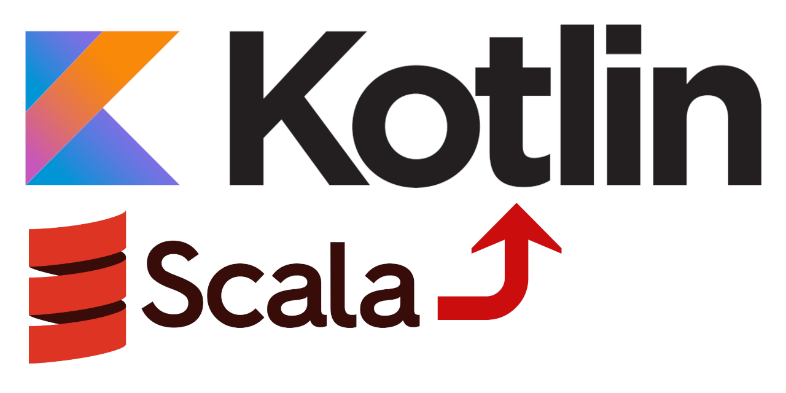

# Scala to Kotlin Converter



Convert Scala source code to Kotlin source code. Optimized for unit test.

## Installation

If you can use the usual git based package manager ([dein](https://github.com/Shougo/dein.vim),
(vim-plug)[https://github.com/junegunn/vim-plug] etc) to install the converter. But you can also just load the converter
into your current session:

```vim
:source …/autoload/scala2kotlin.vim<CR>"
:source …/plugin/scala2kotlin.vim<CR>"
```

This is especially useful if converting Scala to Kotlin is a one off effort and you don't want to use the converter all
the time.

## Usage

Note that Scala has a very extensive syntax and many quirks. It's not possible to create an one size fits all
conversion. As such the conversion is done in steps.

### `ScalaConvert` (function `scala2kotlin#Convert()`)

The `ScalaConvert` performs the main conversion part. It converts syntax, data type and some common methods.

### `ScalaConvertFunctionTest` (function `scala2kotlin#Convert_Function_Test()`)

The `ScalaConvertFunctionTest` converts unit test using the `org.scalatest.funsuite.AnyFunSuite` unit test framework.
Each function test is converted into method using the back tick notation for the function name

### `ScalaConvertBDDTest` (function `scala2kotlin#Convert_BDD_Test()`)

The `ScalaConvertBDDTest` converts unit test using the `org.scalatest.featurespec.AnyFeatureSpec` and
`org.scalatest.GivenWhenThen` unit test framework. Each feature is converted into a nested class and each scenario is
converted into a method. Again using the back tick notation.

### `ScalaConvert` (function `scala2kotlin#Replace_Illegal_Method_Character`)


### `ScalaConvert` (function `scala2kotlin#Convert`)


<!-- vim: set textwidth=120 nowrap tabstop=4 shiftwidth=4 softtabstop=4 expandtab : -->
<!-- vim: set filetype=markdown fileencoding=utf-8 fileformat=unix foldmethod=marker : -->
<!-- vim: set spell spelllang=en : --
